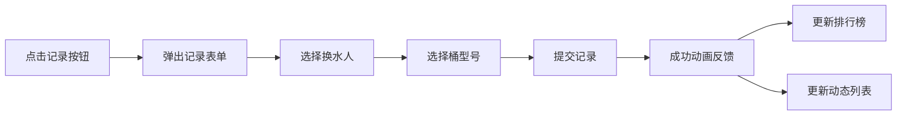

# 办公室换水英雄榜 - 产品需求文档 (PRD)

## 1. 产品概述

办公室换水英雄榜是一个有趣的员工互动记录系统，旨在表彰和鼓励办公室中默默为大家更换饮水机水桶的"幕后供水英雄"。通过游戏化的记录、排行和点赞机制，让这件小事变得有趣且有仪式感，增强团队凝聚力。

- 主要用途：记录办公室员工更换饮水机水桶的行为，按月统计排名，支持匿名点赞
- 目标用户：办公室全体员工
- 产品价值：让默默付出的行为被看见，营造互帮互助的团队文化

---

## 2. 核心功能

### 2.1 用户角色

本系统无需登录注册，所有人均可操作：

| 角色 | 使用方式 | 核心权限 |
|------|----------|----------|
| 办公室员工 | 直接访问使用 | 记录换水、查看排行榜、匿名点赞 |

### 2.2 功能模块

1. **首页（英雄榜主页）**：顶部横幅、当月英雄榜、快速记录入口、最近换水动态
2. **记录换水**：弹出表单，选择换水人、桶型号，自动记录时间
3. **月度排行榜**：按换水次数排名，展示前三名特别荣誉，支持历史月份切换
4. **英雄荣誉墙**：展示所有员工的累计换水数据和获得的点赞数
5. **匿名点赞**：为换水记录点赞，支持查看每条记录的点赞数

### 2.3 页面详情

| 页面名称 | 模块名称 | 功能描述 |
|-----------|-------------|---------------------|
| 首页 | 顶部横幅 | 显示当前月份、本月换水总数、激励标语 |
| 首页 | 月度英雄榜 TOP3 | 金银铜牌展示，头像、姓名、换水次数、获得点赞 |
| 首页 | 快速记录按钮 | 浮动按钮，点击弹出换水记录表单 |
| 首页 | 最近换水动态 | 时间线展示最近20条换水记录，含姓名、时间、桶型号、点赞按钮 |
| 记录弹窗 | 换水人选择 | 下拉选择已有员工或添加新员工 |
| 记录弹窗 | 桶型号选择 | 常见桶型号（5加仑/18.9L、3加仑/11.3L、迷你桶/5L） |
| 记录弹窗 | 确认提交 | 提交后显示成功动画 |
| 排行榜页 | 月份切换 | 下拉选择历史月份查看对应榜单 |
| 排行榜页 | 完整排名列表 | 第四名及以后的员工排名，显示换水次数和点赞数 |
| 荣誉墙页 | 员工卡片网格 | 展示每位员工的累计数据，含头像、累计换水、累计点赞 |
| 荣誉墙页 | 成就徽章 | 根据累计换水数量解锁不同徽章（新手→青铜→白银→黄金→王者） |

---

## 3. 核心流程

### 3.1 记录换水流
员工点击"我换了水"按钮 → 弹出记录表单 → 选择自己的名字（或新增） → 选择桶的型号 → 点击确认 → 显示成功动画 → 自动更新排行榜和动态列表

### 3.2 匿名点赞流程
用户浏览动态列表 → 点击某条记录的点赞按钮 → 点赞数+1 → 按钮显示已点赞状态 → 更新该员工的累计点赞数

---

## 4. 用户界面设计

### 4.1 设计风格

**整体风格：活泼有趣、充满仪式感的水主题设计**

- **主色调**：清爽水蓝色 `#3B82F6`（代表水的纯净），辅以活力橙 `#F97316`（点赞按钮）
- **辅助色**：金色 `#EAB308`（冠军）、银色 `#9CA3AF`（亚军）、铜色 `#D97706`（季军）
- **背景色**：柔和的淡蓝渐变 `from-blue-50 to-cyan-50`，带有微妙的水波纹纹理
- **按钮风格**：圆润胶囊形按钮，带轻微阴影和悬浮放大效果
- **字体**：标题使用 `ZCOOL KuaiLe`（中文快乐体，活泼有趣），正文使用 `Noto Sans SC`（清晰易读）
- **布局风格**：卡片式布局，圆角大（rounded-2xl），柔和阴影，水波纹装饰元素
- **图标风格**：Emoji 图标，大量使用 💧、🏆、🥇、🥈、🥉、👍、🪣 等与主题相关的表情

### 4.2 页面设计概述

| 页面名称 | 模块名称 | UI 元素描述 |
|-----------|-------------|-------------|
| 首页 | 顶部横幅 | 大渐变背景，水滴飘落动画，本月数据统计卡片 |
| 首页 | TOP3 英雄榜 | 三列卡片式布局，冠军居中放大，戴皇冠特效 👑，金银铜色渐变边框 |
| 首页 | 快速记录按钮 | 右下角浮动圆形按钮，蓝色渐变，水波纹扩散动画 |
| 首页 | 最近动态 | 时间线样式，左侧水滴图标，记录卡片悬浮上移效果 |
| 记录弹窗 | 表单 | 毛玻璃效果 backdrop-blur，居中弹出，淡入缩放动画 |
| 排行榜页 | 完整排名 | 列表式，每行带排名序号、员工信息、数据条形图 |
| 荣誉墙页 | 员工卡片 | 网格布局，卡片悬浮翻转效果，显示徽章和累计数据 |

### 4.3 响应式设计

- 桌面端（>1024px）：三列布局展示 TOP3，动态列表双列
- 平板端（768-1024px）：TOP3 纵向排列，动态列表单列
- 移动端（<768px）：单列布局，所有元素自适应宽度，触控区域≥44px

### 4.4 动画与交互动效

1. **页面加载**：元素从下往上依次淡入，带错开延迟（staggered reveal）
2. **记录成功**：水桶图标 🪣 落入水中的波纹扩散动画
3. **点赞按钮**：点击时缩放弹跳 +1 数字飘动效果
4. **排行榜更新**：数据变化时数字滚动动画（count-up）
5. **鼠标悬浮**：卡片轻微上浮 + 阴影加深 + 水蓝色光晕
