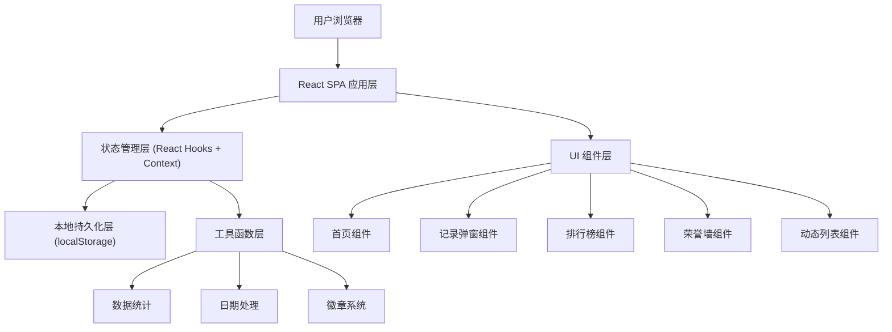

# 办公室换水英雄榜 - 技术架构文档

## 1. 架构设计

本项目为纯前端单页应用（SPA），无需后端服务，数据通过浏览器 localStorage 持久化存储。



---

## 2. 技术描述

- **前端框架**：React 18 + TypeScript
- **构建工具**：Vite 5
- **样式方案**：Tailwind CSS 3 + CSS 自定义动画
- **路由**：React Router DOM 6（Hash 模式，适配静态部署）
- **状态管理**：React Context + useReducer
- **数据存储**：localStorage（本地持久化，无需后端）
- **字体**：Google Fonts (ZCOOL KuaiLe, Noto Sans SC)
- **图标**：Emoji + SVG 自定义
- **部署方式**：纯静态文件，可部署于任意静态托管平台

---

## 3. 路由定义

| 路由 | 页面组件 | 用途 |
|-------|---------|------|
| `/` | HomePage | 首页：英雄榜 TOP3 + 最近动态 |
| `/ranking` | RankingPage | 月度排行榜完整列表 + 月份切换 |
| `/hall-of-fame` | HallOfFamePage | 英雄荣誉墙 + 成就徽章 |

---

## 4. 数据模型

### 4.1 数据模型定义

```mermaid
erDiagram
    EMPLOYEE ||--o{ WATER_RECORD : "has
    EMPLOYEE {
        string id PK
        string name
        string avatar
        number totalLikes
    }
    WATER_RECORD {
        string id PK
        string employeeId FK
        string bucketType
        string timestamp
        number likes
    }
```

### 4.2 TypeScript 类型定义

```typescript
// 员工信息
interface Employee {
  id: string;
  name: string;
  avatar: string; // emoji 头像
  totalLikes: number; // 累计获赞总数
}

// 桶型号类型
type BucketType = '5G' | '3G' | 'MINI';

// 换水记录
interface WaterRecord {
  id: string;
  employeeId: string;
  bucketType: BucketType;
  timestamp: string; // ISO 时间戳
  likes: number; // 本条记录获赞数
}

// 桶型号配置
interface BucketConfig {
  type: BucketType;
  label: string;
  liters: string;
  icon: string;
}

// 徽章等级
type BadgeLevel = 'rookie' | 'bronze' | 'silver' | 'gold' | 'king';

// 徽章配置
interface BadgeConfig {
  level: BadgeLevel;
  name: string;
  icon: string;
  minRecords: number;
  color: string;
}

// 排行榜条目
interface RankingEntry {
  employee: Employee;
  records: number;
  likes: number;
  badge?: BadgeConfig;
}
```

### 4.3 Mock 初始数据

```typescript
// 预置员工初始员工数据
const INITIAL_EMPLOYEES: Employee[] = [
  { id: '1', name: '张伟', avatar: '👨‍💼', totalLikes: 0 },
  { id: '2', name: '李娜', avatar: '👩‍💼', totalLikes: 0 },
  { id: '3', name: '王强', avatar: '👨‍🔧', totalLikes: 0 },
  { id: '4', name: '刘芳', avatar: '👩‍🎨', totalLikes: 0 },
  { id: '5', name: '陈明', avatar: '👨‍💻', totalLikes: 0 },
];

// 桶型号配置
const BUCKET_TYPES: BucketConfig[] = [
  { type: '5G', label: '5加仑', liters: '18.9L', icon: '🪣' },
  { type: '3G', label: '3加仑', liters: '11.3L', icon: '🫗' },
  { type: 'MINI', label: '迷你桶', liters: '5L', icon: '🥤' },
];

// 徽章配置
const BADGE_LEVELS: BadgeConfig[] = [
  { level: 'rookie', name: '换水新手', icon: '💧', minRecords: 1, color: 'text-gray-500' },
  { level: 'bronze', name: '青铜水手', icon: '🥉', minRecords: 5, color: 'text-amber-700' },
  { level: 'silver', name: '白银水侠', icon: '🥈', minRecords: 15, color: 'text-gray-400' },
  { level: 'gold', name: '黄金水神', icon: '🥇', minRecords: 30, color: 'text-yellow-500' },
  { level: 'king', name: '王者水帝', icon: '👑', minRecords: 60, color: 'text-purple-500' },
];
```

---

## 5. 应用状态管理

### 5.1 AppState 结构

```typescript
interface AppState {
  employees: Employee[];
  records: WaterRecord[];
  likedRecords: Set<string>; // 已点赞的记录 ID（防止重复点赞）
}
```

### 5.2 Actions

```typescript
type AppAction =
  | { type: 'ADD_RECORD'; payload: WaterRecord }
  | { type: 'ADD_EMPLOYEE'; payload: Employee }
  | { type: 'LIKE_RECORD'; payload: { recordId: string } }
  | { type: 'LOAD_STATE'; payload: AppState };
```

---

## 6. 工具函数层

### 6.1 数据统计函数

```typescript
// 获取指定月份的排行榜
function getMonthlyRanking(records: WaterRecord[], employees: Employee[], year: number, month: number): RankingEntry[]

// 获取员工累计换水总数
function getEmployeeTotalRecords(employeeId: string, records: WaterRecord[]): number

// 获取员工徽章等级
function getEmployeeBadge(totalRecords: number): BadgeConfig

// 格式化时间显示
function formatTimeAgo(timestamp: string): string

// 格式化月份标签
function formatMonthLabel(year: number, month: number): string
```

### 6.2 本地存储

- `STORAGE_KEY = 'water-hero-data'
- 应用初始化时从 localStorage 读取
- 每次状态变更时自动写入 localStorage
- 首次访问时写入 mock 初始数据 + 随机生成 15-20 条历史记录
